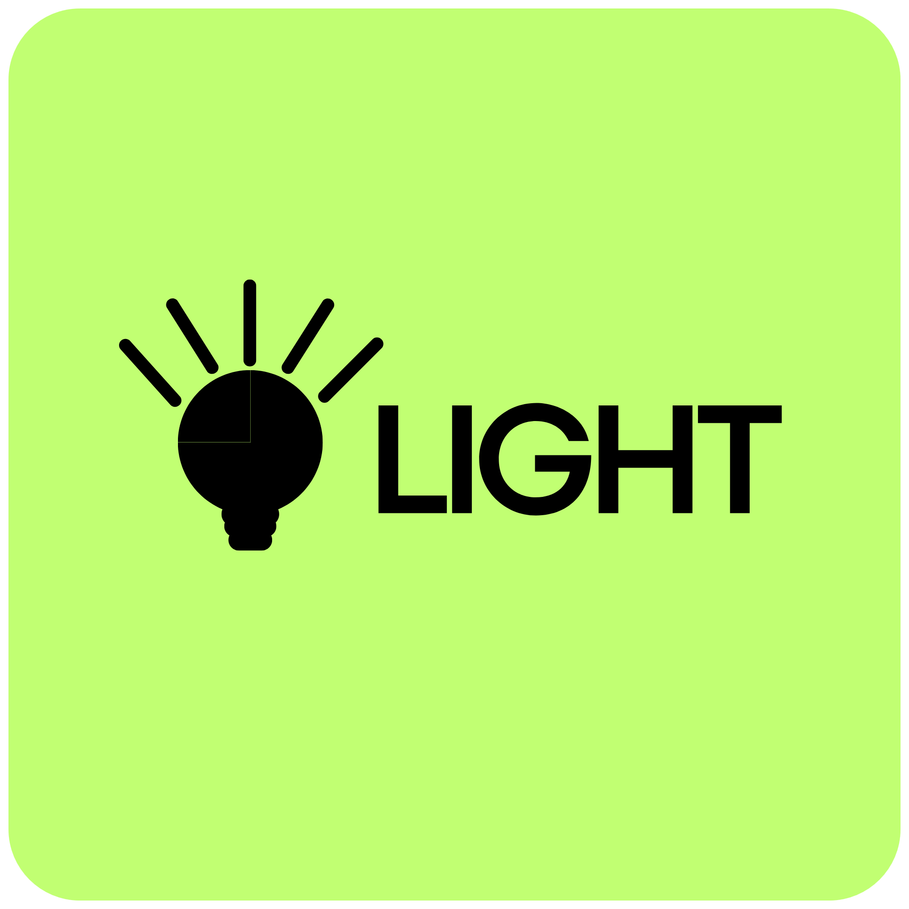

<div align="center">


<h1>Light SDK</h1>


</div>

Light SDK is a professional .NET SDK for ID photo generation and image processing.
It is designed for production apps that need reliable background matting, face-aware framing, beauty adjustments, watermarking, printable layouts, and flexible export options.

## Why Light SDK

1. Production-ready API focused on ID photo workflows.
2. Lightweight NuGet package with external model delivery.
3. Clean integration for desktop, server, and cloud applications.
4. Strong support for passport, visa, and custom document photo standards.

## Install

```bash
dotnet add package Light.SDK
```

## Requirements

1. .NET 10 runtime.
2. Model files downloaded from the official release page.
3. A valid local path where models are extracted.

## Models Download (Required)

The NuGet package is intentionally lightweight and does not include model binaries.

Download models from the official release assets:

- https://github.com/LightPxl/Light-SDK/releases/tag/v0.0.0
After download, extract models into this folder layout:

```text
models/
  detector models/
    Light_faceDetect.lsdkm
  matting models/
    Light.Huma.lsdkm
    Light.lite.lsdkm
    Light.M01.lsdkm
    Light.M02.lsdkm
    Light.M03.lsdkm
    Light.M04.lsdkm
    Light.M05.lsdkm
    Light.M06.lsdkm
    Light.M07.lsdkm
    Light.M08.lsdkm
    Light.M09.lsdkm
    Light.M10.lsdkm
    Light.M11.lsdkm
    Light.M12.lsdkm
    Light.M13.lsdkm
    Light.M14.lsdkm
    Light.M15.lsdkm
    Light.M16.lsdkm
    Light.M17.lsdkm
    Light.M18.lsdkm
    Light.X01.lsdkm
    Light.X02.lsdkm
    Light.X03.lsdkm
    Light.X04.lsdkm
    Light.X05.lsdkm
    Light.X06.lsdkm
    Light.X07.lsdkm
    Light.X08.lsdkm
    Light.X09.lsdkm
    Light.X10.lsdkm
    Light.X11.lsdkm
```

## Quick Start Guide

### 1. Install the package

```bash
dotnet add package Light.SDK
```

Package on NuGet.org: https://www.nuget.org/packages/Light.SDK

### 2. Download and extract models

1. Open the official release page:
   https://github.com/LightPxl/Light-SDK/releases
2. Download the model archive.
3. Extract it to a local folder, for example: `D:\lightpxl\models`

### 3. Create your first ID photo

```csharp
using HivisionIDPhotos.Core.Models.Sdk;
using Light.SDK;

var options = new IdCreatorOptions
{
    ModelsRootPath = @"D:\lightpxl\models"
};

using var creator = new IdCreator(options);

var result = creator.CreateFromFile("input.jpg", cfg => cfg
    .WithSizePreset(IdPhotoSizePreset.AmericanVisa)
    .WithBackgroundColor("FFFFFF")
    .WithModels(FaceDetectionModelPreset.LightFaceDetect, MattingModelPreset.LightLite)
    .WithFaceLayout(headRatio: 0.2, topDistance: 0.12, faceAlign: true)
    .WithStandardExport(OutputImageFormat.Jpeg, dpi: 300));

File.WriteAllBytes("output.jpg", result.StandardImageBytes);
```

## Notes

1. Keep SDK version and downloaded model bundle version aligned.
2. If model paths are wrong, processing will fail at runtime.
3. For best quality, use high-resolution input images with a clear front-facing portrait.

